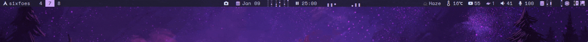

Polybar music visualizer DOTTED [cava](https://github.com/karlstav/cava) (music visualization) module for [polybar](https://github.com/polybar/polybar). Use `cava-dots.sh` in your polybar config.


Dependencies:
- [cava](https://github.com/karlstav/cava)
- [polybar](https://github.com/polybar/polybar)
- font [BinaryClock](https://github.com/jamessouth/polybar-binary-clock-fonts) should support these characters

First, download `cava-dots.sh` to your polybar config folder, say `~/.config/polybar/scripts/`.
and download BinaryClockBoldMono.ttf from [BinaryClock](https://github.com/jamessouth/polybar-binary-clock-fonts) fonts to `~/.local/share/fonts/` folder.

Second, add these lines to config the above font
```ini
[bar/sixfoes]
font-2 = BinaryClock:style=BoldMono:size-8;4
```

Third, add these lines for 12 bars (change accordingly `cava-dots.sh <No-of-bars>`)
```ini
[module/cava-dots]
type = custom/script
tail = true
exec = $HOME/.config/polybar/scripts/cava-dots.sh 12
format = <label>
label = %output%
format-padding = 0
label-foreground = #ffffff
format-font = 2
```
And the last, colors of course
```
[module/cava]
label-foreground = #cba6f7
```

## Note:
If script is not allowed to run; then allow it by running below
```ini
sudo chmod +x cava-dots.sh
```

Enjoy :)
